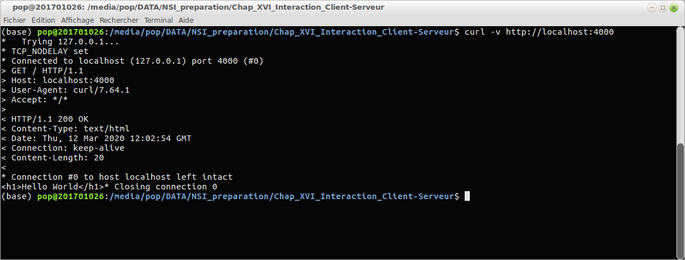
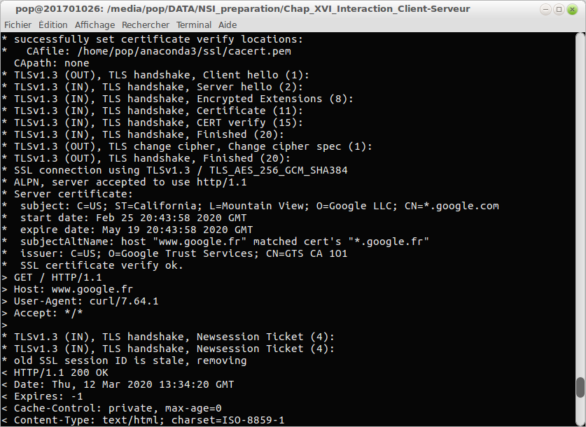
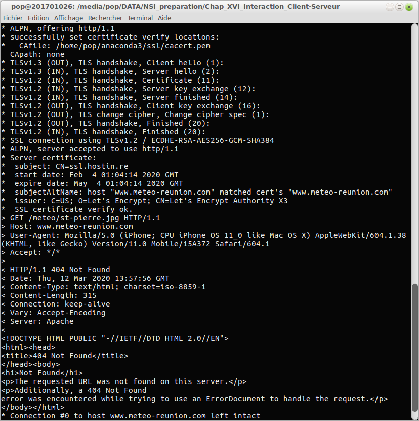
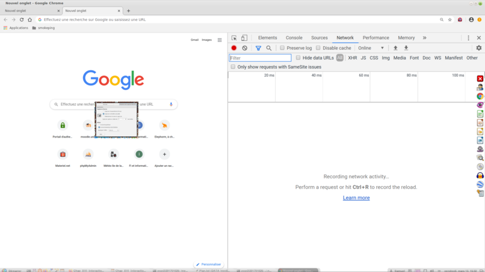

# Modèle

On appelle interaction client $\leftrightarrow$ serveur un mode de communication entre un programme qualifié de *client* qui **envoie des requêtes** et un programme dit *serveur* qui y répond.  
Dans le cas du Web, le client peut être un navigateur (*Google Chrome, Firefox, etc*) et le serveur un programme tel que *Apache, Nginx, etc*. Dans le cadre de ce cours, on utilisera un serveur écrit en Javascript (*Node.js* plus exactement). Le protocole utilisé est **HTTP**.

# Analyse d'un échange

$\triangleright$ Ouvrir un terminal et taper la commande ci-dessous, en remplaçant la séquence `xxx.xxx.xxx.xxx` par l'adresse ip fournie par le professeur:  
```bash
curl -v http://xxx.xxx.xxx.xxx:4000
```
$\triangleright$ Commenter le résultat obtenu.

Les lignes précédées du signe $>$ constituent les requêtes du client et celles précédées du signe $<$ sont les réponses du serveur.  
Les requêtes ont toujours la forme:  
```bash
commande URL version_protocole
Entête
--> ligne vide <--
corps de la requête
```  
`commande` est la méthode à utiliser, elle spécifie le type de requête (voir paragraphe suivant). On peut citer, entre autres: **GET**, **POST** ou **HEAD**.  

De même, les réponses suivent la syntaxe:  
```bash
version_protocole code_réponse texte_réponse
Entête
--> ligne vide <--
corps de la réponse
```
Quelques codes réponse courants: 200 (OK), 404 (NOT FOUND), etc.  


De plus en plus, les échanges entre client et serveur sont chiffrés. De telles communications utilisent la version *sécurisée* **HTTPS** du protocole. Les négociations de chiffrement (on dit aussi le *handshake*) précèdent les envois de données (*voir capture*).  



## Exercice ##

A partir de la capture ci-dessous, retrouver les informations suivantes:  
* la méthode de la requête ainsi que l'url de la ressource demandée;
* le type de serveur et le code de réponse retourné. Quelle en est la signification ?  
* Quel est le type de document renvoyé par le serveur et quel est sa taille ?



# Transmission de paramètres

## Methode GET
$\triangleright$ Ouvrir deux onglets différents dans le navigateur Chrome, en activant la console de développement web (touche F12) et sélectionnt 'Network' dans cette console (à droite).  


  


$\triangleright$ Entrer les deux adresses suivantes (dans lesquelles on modifiera la chaine `xxx`), chacune dans un onglet: 
```bash
http://xxx.xxx.xxx.xxx:4000/date
http://xxx.xxx.xxx.xxx:4000/date?format=svg
```  
$\triangleright$ Commenter les résultats  
$\triangleright$ Dans les consoles de développement, retrouver (onglet *Headers* puis *Request Headers*) la méthode de requête utilisée ainsi que l'url demandée.


**A RETENIR**
On peut passer des paramètres au serveur via l'url. Les paramètres d’une URL servent à influencer la représentation d’une ressource ou information. La méthode GET permet de transmettre des paramètres.  
*Remarque*: on peut passer plusieurs paramètres dans l'url; par exemple pour transmettre deux paramètres `para1` et `para2` on ajoute à l'url:
```bash
?para1=valeur&para2=valeur2
```

## Méthode POST - Cas de formulaire

## Qu'est-ce qu'un formulaire ?
Les formulaires HTML sont les principaux outils d'interaction entre un utilisateur et un serveur. Ils permettent **d'envoyer des données** au serveur web.
## Syntaxe
Pour ajouter un formulaire à une page HTML, on utilisera la balise `form`:  
```html
<form action="url_de_traitement" method="POST">
    ...
    ...
</form>
```
`url_de_traitement` est à adapter !
A l'intérieur d'un formulaire, on place généralement des *contrôles* repérés par des balises `<input>` dont le rendu dans le navigateur va dépendre de son attribut `type`. Les contrôles `<input>` sont souvent associés à une légende dont le contenu est fixée par une balise `<label>`. Par exemple, le code  
```html
<label for="nom">Nom (entre 4 et 8 caractères):</label>
<input type="text" id="nom" name="nom" minlength="4" maxlength="8" size="10">
```
fournira le rendu:


```python
from IPython.core.display import HTML
HTML("""
<form action="localhost:4000" method="POST">
    <label for="nom">Nom (entre 4 et 8 caractères):</label>
    <input type="text" id="nom" name="nom" minlength="4" maxlength="8" size="10">
</form>
""")
```


<form action="localhost:4000" method="POST">
    <label for="nom">Nom (entre 4 et 8 caractères):</label>
    <input type="text" id="nom" name="nom" minlength="4" maxlength="8" size="10">
</form>


$\triangleright$ Ouvrir le fichier `index.html` avec Visual Studio Code. Repérer le formulaire. Combien de contrôles sont présents ?  
$\triangleright$ Modifier l'url de traitement de la balise `<form>` selon les instructions du professeur.  
$\triangleright$ Ouvrir le fichier `index.html` avec le navigateur Chrome ainsi que la console de développement web.  
$\triangleright$ Valider le formulaire. Commenter les résultats, côté client puis côté serveur.


```python

```


```python

```
