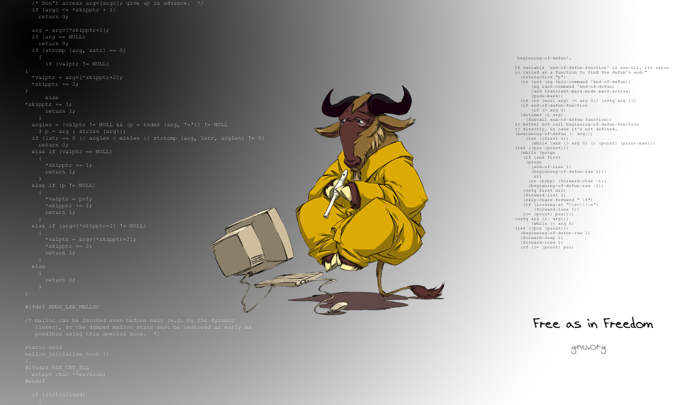

---
author:
- Guillaume Connan
date: 'October 13, 2019'
title: Système 1
---

# Système 1

## Unix, Linux, GNU et les logiciels libres

### Unix

Dennis RITCHIE regarde Ken THOMPSON taper
sur un terminal Teletype 33 relié au PDP-11/20 juste en face. Nous
sommes en 1972 et ils viennent de mettre au point le *système
d'exploitation* UNIX:


Le but est de pouvoir disposer d'un sytème d'exploitation utilisable sur
toute machine. Il était initialement écrit en assembleur puis en langage
C en 1973 après l'invention de ce langage par RITCHIE.

S'ensuit une guerre de licences, surtout après qu'un étudiant
californien, Billy JOY modifie UNIX et le
distribue pour juste \$40 sous l'appellation *Berkeley Software
Distribution* (BSD)[^1].

Dans les années 1990, les noyaux Linux et FreeBSD, basés sur
UNIX, apparaissent et sont diffusés librement dans le
monde entier sous l'impulsion de programmeurs enthousiastes. En 2000,
Apple sort le système d'exploitation Darwin (qui sera ensuite rebaptisé
MacOS) basé lui aussi sur UNIX.

La philosophie d'UNIX a été résumée en 2003 par Eric S.
RAYMOND en dix grandes règles:

1. **Règle de Modularité** : Écrire des éléments simples reliés par de bonnes interfaces.

2. **Règle de Clarté**   : La Clarté vaut mieux que l'ingéniosité.

3. **Règle de Composition**: Concevoir des programmes qui peuvent être reliés à d'autres
    programmes.

4. **Règle de  Séparation**: Séparer les règles du fonctionnement  ; Séparer les
   interfaces du mécanisme. 

5.  **Règle de  Simplicité**:  Concevoir  pour la  simplicité  ;  ajouter de  la
   complexité seulement 
    par obligation.

6. **Règle de Parcimonie** : Écrire un gros programme seulement lorsqu'il est clairement
    démontrable que c'est l'unique solution.

7. **Règle de Transparence** : Concevoir pour la visibilité de façon à faciliter la revue et le
    déverminage. 

8. **Règle de Robustesse**: La robustesse  est l'enfant de la transparence et de
   la simplicité. 

9. **Règle de Représentation** : : Inclure le savoir dans les données, de manière que l'algorithme
    puisse être bête et robuste.

10. **Règle de La moindre surprise** : Pour la conception d'interface, réaliser la chose la moins
    surprenante.

11. **Règle du Silence**
:   Quand un programme n'a rien d'étonnant à dire, il doit se taire.

12. **Règle de Dépannage**
:   Si le programme échoue, il faut le faire bruyamment et le plus tôt
    possible.

13. **Règle d'Économie**
:   Le temps de programmation est cher, le préserver par rapport au
    temps de la machine.

14. **Règle de Génération**
:   Éviter la programmation manuelle ; Écrire des programmes qui
    écrivent des programmes autant que possible.

15. **Règle d'Optimisation**
:   Prototyper avant de fignoler. Mettre au point avant d'optimiser.

16. **Règle de Diversité**
:   Se méfier des affirmations de « Unique bonne solution ».

17. **Règle d'Extensibilité**
:   Concevoir pour le futur, car il arrivera plus vite que prévu.

Ce qu'il résume aussi en **Keep it Simple, Stupid!**, connu comme le
*KISS principle*.

Ces règles n'ont malheureusement pas toujours été suivies dans les
versions dérivées d'UNIX\...

Environ 85% des smartphones sont des systèmes UNIX, les
500 plus grands supercalculateurs sont des systèmes Linux donc dérivés
d'UNIX.

Les grands principes de fonctionnement des systèmes UNIX
sont:

-   de disposer d'interpréteurs de commande appelés des *shells*;

-   de disposer de nombreux petits programmes agissant sur des flux de
    texte et reliés par des tubes (*pipes*;

-   tout est fichier ou processus. Tout est organisé autour d'un système
    de fichiers hiérarchique ayant une unique racine.

[^1]: Pendant cette guerre qui aura lieu pendant les années 1980,
    Windows basé sur MS-DOS aura les coudées franches pour s'imposer\...


### GNU


Alors chercheur au laboratoire d'IA du MIT en 1980, Richard
STALLMANN rapporte l'anecdote suivante:

>  *Une fois, j'ai vu ce que c'est d'utiliser un programme dont on ne
> connaît pas le code source. Ça s'est passé quand Xerox a donné au MIT
> une imprimante laser. C'était \[...\] la première génération des
> imprimantes laser. \[...\] C'était vraiment bien, mais pas tout à fait
> fiable. Parfois, plusieurs fois par heure, elle se bloquait. \[...\]
> Notre ancienne imprimante avait le même problème, mais l'ancienne
> était contrôlée par du logiciel libre, donc nous possédions le code
> source pour ce programme, et nous avions pu ajouter des
> fonctionnalités spéciales pour nous débrouiller avec ces problèmes.
> Avec la nouvelle imprimante, nous n'avons pas pu le faire car Xerox ne
> nous avait pas donné le code source du programme. Nous ne pouvions pas
> faire de changements dans le programme. Nous étions capables d'écrire
> ces fonctions mais nous étions bloqués volontairement par Xerox, nous
> étions prisonniers d'un logiciel qui a mal fonctionné pendant
> plusieurs années. \[...\] C'était dégueulasse*

{width="\linewidth"}


C'est suite à cette histoire qu'il décide de lancer le projet
GNU (GNU Is not UNIX) qui doit
fournir une version d'UNIX entièrement libre. Mais
qu'est-ce qu'un logiciel libre?

Voici la définition de la *Free Software Foundation*
(FSF):

>  *« Logiciel libre » \[free software\] désigne des logiciels qui
> respectent la liberté des utilisateurs. En gros, cela veut dire que
> les utilisateurs ont la liberté d'exécuter, copier, distribuer,
> étudier, modifier et améliorer ces logiciels. Ainsi, « logiciel libre
> » fait référence à la liberté, pas au prix (free as free speech as
> opposed to free beer).*

Un programme est ainsi un logiciel libre si vous, en tant qu'utilisateur
de ce programme, avez les quatre libertés essentielles :

-   la liberté d'exécuter le programme comme vous voulez, pour n'importe
    quel usage (liberté 0);

-   la liberté d'étudier le fonctionnement du programme, et de le
    modifier pour qu'il effectue vos tâches informatiques comme vous le
    souhaitez (liberté 1) ; l'accès au code source est une condition
    nécessaire;

-   la liberté de redistribuer des copies, donc d'aider votre voisin
    (liberté 2);

-   la liberté de distribuer aux autres des copies de vos versions
    modifiées (liberté 3); en faisant cela, vous donnez à toute la
    communauté une possibilité de profiter de vos changements; l'accès
    au code source est une condition nécessaire.

La plupart des distributions UNIX étant propriétaires,
STALLMANN décide de créer un système d'exploitation
entièrement libre et lance GNU en 1983. Toutes les
commandes UNIX ont été ré-implantées.

En 1991,GNU est presque prêt. Il lui manque un noyau.
L'équipe travaille sur un noyau dénommé HURD mais\....

## Linux


...au même moment,  un jeune étudiant finlandais, Linus TORVALDS,  crée le noyau
LINUX et le publie 
sous licence libre. C'est la naissance du système d'exploitation
GNU/Linux qui va connaître un succès mondial.

Linux est un énorme programme d'une dizaine de Mo écrit principalement
en C et ne contenant aucun code original UNIX, mais, sauf
sur des systèmes embarqués, il ne saurait se suffire à lui-même. Il doit
donc être associé àGNU pour former un véritable système
d'exploitation (OS) ou encore Android par exemple. On doit donc parler
de GNU/Linux ou de Android/Linux.

### Différents types de logiciels


* **Propriétaires**
:   : ils sont distribués sous une licence restrictive qui interdit de
    les copier, modifier, d'avoir accès aux sources.

* **Sharewares**
:   : ils sont distribués gratuitement pendant une période d'essai puis
    les utilisateurs doivent payer pour les utiliser.

* **Freewares**
:   Ici le *free* signifie gratuit: ce sont donc des logiciels
    disponibles gratuitement mais ils sont le plus souvent sous la
    formes de binaires donc on ne peut pas les modifier ni savoir
    comment ils ont é conçus.

* **Free softwares**
:   : ce sont les logiciels libres. On vient d'en parler.

### Qu'est-ce qu'un système d'exploitation?


Il y a plusieurs SE (ou OS) comme ceux déjà évoqués mais aussi MS-DOS,
MS-Windows, Windows-NT,...

Nous ne nous intéresserons qu'aux systèmes UNIX et plus
particulièrement GNU/Linux.

#### Système informatique


Un système informatique est constitué:

1.  du matériel (*hardware*): CPU, mémoire, E/S;

2.  du système d'exploitation qui est un programme jouant le rôle
    d'intermédiaire entre les utilisateurs et le matériel;

3.  des programmes d'application à disposition des utilisateurs afin de
    résoudre leurs problèmes;

4.  des utilisateurs qui peuvent être des êtres humains mais aussi des
    machines.

#### But d'un SE


Le SE doit:

1.  fournir un environnement pratique afin que l'utilisateur (humain ou
    machine) puisse exécuter des programmes;

2.  utiliser efficacement les ressources matérielles.

#### Rôles d'un SE


1.  C'est une *machine virtuelle* en ce sens qu'elle permet à
    l'utilisateur d'avoir accès aux ressources en faisant *abstraction*
    des détails de fonctionnement. Les objets abstraits impliqués sont
    les *fichiers* et les *processus*.

    Ainsi un disque physique apparaît comme un répertoire de fichiers.

2.  C'est aussi un *administrateur de ressources* qui gère leur
    utilisation sans impliquer l'utilisateur (processus, mémoire,
    fichiers, E/S).

### Modes de fonctionnement


Pour éviter qu'un mauvais programme ne sème la pagaïe dans le système,
il est protégé par le *mode double*. Certaines instructions critiques
sont dites *privilégiées*. Les deux modes sont:

* **Mode utilisateur** : dans ce mode, il n'est pas possible d'exécuter une instruction
    privilégiée. Toute tentative de le faire est traitée comme illégale.

* **Mode SUperviseur**   : les instructions privilégiées ne peuvent être exécutées que dans
    ce mode.

Nous détaillerons ces modes sur GNU/Linux plus loin.

```shell
moi@moi: $aptitude update
E: Impossible d ouvrir le fichier verrou /var/lib/apt/lists/lock - open (13: Permission non accordée)
E: Impossible de verrouiller le répertoire /var/lib/apt/lists/

moi@moi:~$ sudo aptitude update 
Mot de passe de moi :
http://ftp.debian.org/debian sid InRelease Atteint
http://deb.debian.org/debian buster InRelease 39.1 ko téléchargés en 2s
(15.8 ko/s)
```


## Shell


C'est l'interface pour parler au système. C'est la coque (*shell*) au
sens d'un fruit sec qui contient le noyau (*kernel*) : c'était la couche
la plus haute du système par opposition aux couches de bas-niveau au
niveau matériel.

Il existe de nombreux shells: `sh` (le shell historique créé par le
Britannique Stephen BOURNE en 1977), `ksh`, `csh`, `tcsh`,
`zsh` mais celui que nous utiliserons est `bash` (comme Bourne Again
SHell, encore un jeu de mot...Bourne/born et de plus *to bash* signifie
frapper, cogner.

En classe, nous travaillerons sur nos Raspberries PI.


### Commandes

Une commande est lancée en tapant quelque chose sous la forme:

    nom_commande -les_options arg1 arg2 arg3 ...

Par exemple:

```shell
    $ ls -l ./LYCEE/INFO/1ere/2019_20/Systeme/systeme19.tex 
    -rw-r--r-- 1 moi moi 15439 Sep 29 17:10 ./LYCEE/INFO/1ere/2019_20/Systeme/systeme19.tex
```

Le signifie qu'on est en mode utilisateur. Le indiquera qu'on sera en
mode superviseur.

Les arguments de la fonction sont séparés par des espaces.

Il existe des commandes internes, encore appelées *primitives*
(*builtin*, qui est directement interprétée par le Shell.

Il y a également des commandes externes qui renvoie à un fichier
exécutable dont on indique le chemin d'accès sauf s'il est dans le
chemin d'accès aux exécutables, le `PATH` (qui est une variable
d'environnement. Nous en reparlerons plus tard). La commande `type` nous
permet de distinguer ces types de commmandes:

```shell
    $ type echo
    echo est une primitive du shell

    $ type python
    python est /home/moi/anaconda3/bin/python
```

On peut obtenir de l'aide sur une commande en mettant comme option:

    $ type --help
    "type: type [-afptP] nom [nom ...]
        Affiche des informations sur le type de commande.
        
        Pour chaque NOM, indique comment il serait interprété s'il était
        utilisé comme un nom de commande.
        
        Options :
          -a    affiche tous les emplacements contenant un exécutable nommé NOM;
                y compris les alias, les commandes intégrées et les fonctions si et seulement si
                l'option « -p » n'est pas utilisée
          -f    désactive la recherche de fonctions du shell
          -P    force une recherche de CHEMIN pour chaque NOM, même si c'est un alias,
                une commande intégrée ou une fonction et renvoie le nom du fichier du disque
                qui serait exécuté
          -p    renvoie le nom du fichier du disque qui serait exécuté sauf si
                « type -t NOM » aurait renvoyé autre chose que « file » auquel cas, rien
                n'est renvoyé.
          -t    affiche un mot unique parmi « alias », « keyword »,
                « function », « builtin », « file » or « », si NOM est respectivement un alias,
                un mot réservé du shell, une fonction du shell, une commande intégrée,
                un fichier du disque ou un nom inconnu
        
        Arguments :
          NOM   Nom de commande à interpréter.
        
        Code de retour :
        Renvoie le code de succès si tous les NOMs sont trouvés, le code d'échec si l'un
        d'entre eux n'est pas trouvé."

### Erreurs: premier survol

Vous serez sûrement amenés à lire quelqes messages d'erreur:

1.  Bash ne trouve pas votre commande, soit parce qu'elle n'existe pas,
    soit parce qu'elle n'est pas dans le `PATH`, soit que son nom est
    mal tapé,...

```shell
        $ fantome
        bash: fantome : commande introuvable
```

2.  un des arguments est erroné. Par exemple ici on demande de copier un
    fichier qui n'existe pas ou dont le chemin d'accès est mauvais:

```shell
        $ cp fantome /home/moi
        cp: impossible d\'évaluer 'fantome': Aucun fichier ou dossier de ce type
```

3.  un utilisateur essaie d'effectuer une action seulement permise au
    superviseur:

```shell
        $ touch fichier.txt # permet ici de créer le fichier fichier.txt

        $ cp fichier.txt /usr/bin/
        cp: impossible de créer le fichier standard '/usr/bin/fichier.txt': Permission non accordée

        $ rm fichier.txt # permet de détruire le fichier fichier.txt
```

4.  on lance une commande avec une mauvaise option:

```shell
        $ touch fichier.txt
        [moi@moi ~]$ cp fichier.txt /usr/bin/
        cp: impossible de créer le fichier standard '/usr/bin/fichier.txt': Permission non accordée
        $ rm fichier.txt
```

La gestion des erreurs est un problème important sur lequel nous
reviendrons.

### Le clavier est votre ami



Il ne faut pas confondre affluence d'icônes à cliquer et ergonomie. Le
shell est un des outils les plus ergonomiques en ce sens qu'il permet
d'exprimer de manière concise et précise tout ce que l'on veut faire
faire à la machine.

Par exemple, les flèches , permettent de rappeler la commande précédente
ou la commande suivante. Pour la petite histoire, c'est Bill
GATES qui a codé ces touches UNIX quand il
était étudiant :)

L'autre touche extrèmement utile est la tabulation qui permet de
**compléter** les noms de commandes, de fichiers en ne tapant que les
premiers caractères. Cela évite les fautes de frappe et permet aussi de
vérifier si ce que l'on tape ou cherche existe bien.

### Caractères génériques

Nous ne parlerons pas déjà d'expressions régulières mais deux caractères
génériques (*wildcards*) seront utiles: l'astérisque et le point
d'interrogation.

L'astérisque permet de remplacer n'importe quel nombre de caractères.

Par exemple, si nous cherchons tous les fichiers dont le nom commence
par *PolyInfo* du répertoire courant:

```shell
    $ ls PolyInfo*
    PolyInfo1ere_19_20.aux  PolyInfo1ere_19_20.log  PolyInfo1ere_19_20.out  PolyInfo1ere_19_20.pdf  PolyInfo1ere_19_20_Tab.mp  PolyInfo1ere_19_20.tex
```

Maintenant si je cherche les fichiers dont l'extension s'écrit avec
trois lettres, la dernière étant *x*, je peux utiliser qui représente un
caractère quelconque:

```shell
    $ ls *.??x
    config.cxx  PolyInfo1ere_19_20.aux  PolyInfo1ere_19_20.tex
```

Le système de fichiers
----------------------

Dans un système UNIX, tout est fichier, que ce soit de
manière classique un fichier contenant des données, mais aussi un
répertoire, un lien vers un autre fichier, un canal de communication
vers un processus,\...

Dans un premier temps, nous ne nous occuperons que des fichiers au sens
classique (*regular files*).

Le système peut être vu comme un **arbre** dont les **nœuds** sont les
**répertoires** et les **feuilles** sont les **fichiers**.

La commande `tree` avec l'option `-L` fixée à 1 nous renvoie
l'arborescence de niveau 1 d'un répertoire.

Regardons l'arborescence de niveau 1 à la racine qui est symbolisée par
:

```shell
    $ tree -L 1 /
    /
    |--- bin
    |--- boot
    |--- dev
    |--- etc
    |--- home
    |--- initrd.img -> boot/initrd.img-5.2.0-2-amd64
    |--- initrd.img.old -> boot/initrd.img-4.9.0-9-amd64
    |--- lib
    |--- lib32
    |--- lib64
    |--- lost+found
    |--- media
    |--- mnt
    |--- opt
    |--- proc
    |--- R
    |--- root
    |--- run
    |--- sbin
    |--- snap
    |--- srv
    |--- sys
    |--- tmp
    |--- usr
    |--- var
    |--- vmlinuz -> boot/vmlinuz-5.2.0-2-amd64
    |--- vmlinuz.old -> boot/vmlinuz-4.9.0-9-amd64

    23 directories, 4 files
```


Voyons maintenant l'arborescence complète du répertoire personnel d'un
utilisateur (`joe`):


Si l'on veut la liste des fichiers présents dans le répertoire
`France_Culture`, on utilise **`ls`** (comme LiSte):

```shell
    joe@moi:~$ ls ./Documents/Podcasts/France_Culture/
    Cesar.ogg  Fanny.ogg  Marius.ogg
```

Si l'on veut plus de renseignements, on rajoute l'option **`-l`** (comme
Long):

```shell
    joe@moi:~$ ls -l ./Documents/Podcasts/France_Culture/
    total 0
    -rw-r--r-- 1 joe joe 0 Sep 30 23:10 Cesar.ogg
    -rw-r--r-- 1 joe joe 0 Sep 30 23:10 Fanny.ogg
    -rw-r--r-- 1 joe joe 0 Sep 30 23:10 Marius.ogg
```

Expliquez ce qui se passe ici:

```shell
    joe@moi:~$ rm ./Documents/Podcasts/France_Culture/Marius.ogg 

    joe@moi:~$ ls ./Documents/Podcasts/France_Culture/
    Cesar.ogg  Fanny.ogg

    joe@moi:~$ cp  ./Documents/Podcasts/France_Culture/Cesar.ogg ./Documents/Podcasts/BBC/

    joe@moi:~$ ls ./Documents/Podcasts/France_Culture/
    Cesar.ogg  Fanny.ogg

    joe@moi:~$ ls ./Documents/Podcasts/BBC/
    Cesar.ogg Wasps.ogg

    joe@moi:~$ mv ./Documents/Podcasts/BBC/Cesar.ogg ./Documents/Podcasts/France_Culture/SesZars.ogg

    joe@moi:~$ ls ./Documents/Podcasts/BBC/
    Wasps.ogg

    joe@moi:~$ ls ./Documents/Podcasts/France_Culture/
    Cesar.ogg  Fanny.ogg  SesZars.ogg
```

...et là, en regardant la documentation des commandes:


```shell
    joe@moi:~$ pwd
    /home/joe

    joe@moi:~$ whoami
    joe

    joe@moi:~$ cd ./Documents/Podcasts/

    joe@moi:~/Documents/Podcasts$ cd ./BBC/

    joe@moi:~/Documents/Podcasts/BBC$ cd ..

    joe@moi:~/Documents/Podcasts$ cd ../../Info/1ere/

    joe@moi:~/Info/1ere$ ls
    Cours  Defis  Projets
```

Nous avons vu en cours , , :

```shell
    joe@moi:~$ cd ./Info/1ere/Defis/
    joe@moi:~/Info/1ere/Defis$ cp ./defi4.py ../../../TP_systeme/commandes/
    joe@moi:~/Info/1ere/Defis$ ls ~/TP_systeme/commandes/
    defi4.py  essai2.txt
```

Ces commandes ne concernent que les fichiers. Pour les répertoires, il
faut faire autrement:

```shell
    joe@moi:~/Info/1ere$ rmdir Projets/
    joe@moi:~/Info/1ere$ ls
    Cours  Defis
    joe@moi:~/Info/1ere$ rmdir Defis/
    rmdir: impossible de supprimer 'Defis/': Le dossier n'est pas vide
```

On ne peut supprimer qu'un dossier vide. Il faut donc vider le dossier
avant de le supprimer:


```shell
    joe@moi:~/Info/1ere$ mkdir ./Projets
    joe@moi:~/Info/1ere$ touch ./Projets/fic1.alive
    joe@moi:~/Info/1ere$ touch ./Projets/fic2.alive
    joe@moi:~/Info/1ere$ rmdir Projets/
    rmdir: impossible de supprimer 'Projets/': Le dossier n'est pas vide
    joe@moi:~/Info/1ere$ rm -r Projets/
    joe@moi:~/Info/1ere$ ls
    Cours  Defis
```


L'option `-r` signifie *récursivement*: la commande de destruction va
être appliquer à toute l'arborescence contenue sur la branche `Projets`
et finalement sur la branche `Projets` elle-même.

Une autre commande importante à connaître : **find** qui, comme son nom
l'indique, permet de trouver des fichiers qui obéissent à un certain
critère.


```shell
    joe@moi:~/Truc$ find ./Python/ -name '*.ogg'
    ./Python/Documents/Podcasts/France_Culture/Marius.ogg
    ./Python/Documents/Podcasts/France_Culture/Fanny.ogg
    ./Python/Documents/Podcasts/France_Culture/Cesar.ogg
```


On cherche les fichiers à partir du répertoire `Python` dont le nom à
pour extension `ogg`.

Commandes à connaître:

`whoami,  cd,  pwd, ls,  cp,    mv, rm, rmdir, tree`
Nous avons également vu en classe le principe de l'arborescence, les
répertoires et

Redirections, flux et processus
-------------------------------

### Processus

Un **processus** est une instance d'un programme *en train de
s'exécuter*. Nous étudierons plus précisément leur gestion en Terminale.
Il faut tout de même savoir que le noyau Unix permet de gérer plusieurs
tâches et plusieurs utilisateurs grâce à l'*ordonnanceur* (*the
scheduler*) et qu'un processus peut être actif, prêt, endormi ou
suspendu.

Par exemple, en lançant la commande `top`:


Nous n'insisterons pas.

Sachez cependant que si je lance un processus puis que je ferme le
shell, alors le processus (enfant) sera tué avec le shell (son processus
parent). Les options & et &! permettent dans le premier cas de lancer
plusieurs processus par le même shell sans tuer les autres, et dans le
second cas, je peux tuer le shell parent sans tuer les enfants.

### Flux

Il faut surtout retenir en 1 qu'un processus a *trois flux* ou *trois
canaux de communication*: un d'entrée, un de sortie et un pour les
erreurs.

Par exemple, voyons la commande `read`:

```shell
    joe@moi:~/Info/1ere$ read ma_variable
```

Il semble ne rien se passer. En fait, le shell attend une valeur dans le
flux d'entrée qui sera stocké dans la variable `ma_variable`:

```shell
    joe@moi:~/Info/1ere$ read ma_variable
    2 + 3 = 5

    joe@moi:~/Info/1ere$ echo $ma_variable
    2 + 3 = 5
```

La fonction `echo` répète ce que contient la variable qui est appelée
avec un \$ devant.

### Redirection

Il faut prendre les flux comme des informations qui entrent et sortent
par ces trois tuyaux. On peut alors rediriger ces flux dans d'autres
tuyaux.

Observez et commentez:


```shell
    joe@moi:~$ mkdir -p ~/TP_systeme/commandes/
    joe@moi:~$ cd ~/TP_systeme/commandes/

    joe@moi:~/TP_systeme/commandes$ touch essai2.txt
    joe@moi:~/TP_systeme/commandes$ echo 'Bonjour le monde' > essai2.txt 
    joe@moi:~/TP_systeme/commandes$ cat essai2.txt 
    Bonjour le monde

    joe@moi:~/TP_systeme/commandes$ echo 'Hello world' > essai2.txt 
    joe@moi:~/TP_systeme/commandes$ cat essai2.txt 
    Hello world
    joe@moi:~/TP_systeme/commandes$ echo 'Hola mundo' >> essai2.txt 
    joe@moi:~/TP_systeme/commandes$ cat essai2.txt 
    Hello world
    Hola mundo
```

Les caractères et permettent des redirections mais de manière
différente. Expliquez.

Expliquez ensuite le code suivant, sachant que le `2` devant les
chevrons indique que les erreurs seront redirigées vers la cible
indiquée:


```shell
    joe@moi:~/Info/1ere$ touch erreurs.log
    joe@moi:~/Info/1ere$ ls mystere 2>> erreurs.log
    joe@moi:~/Info/1ere$ cp mystere 2>> erreurs.log
    joe@moi:~/Info/1ere$ cp mystere ~ 2>> erreurs.log
    joe@moi:~/Info/1ere$ mystere 2>> erreurs.log
    joe@moi:~/Info/1ere$ more erreurs.log 
    ls: impossible d accéder à 'mystere': Aucun fichier ou dossier de ce type
    cp: opérande de fichier cible manquant après 'mystere'
    Saisissez « cp --help » pour plus d'informations.
    cp: impossible d évaluer 'mystere': Aucun fichier ou dossier de ce type
    -bash: mystere : commande introuvable
```

On peut également rediriger des fichiers dans le flux d'entrée avec un
chevron dans l'autre sens. Regardons par exemple comment fonctionne la
commande `bc` qui est une machine à calculer (avec l'option `-q` pour ne
pas avoir l'en-tête de lancement de la commande):

```shell
    joe@moi:~/Info/1ere$ bc
    bc 1.07.1
    Copyright 1991-1994, 1997, 1998, 2000, 2004, 2006, 2008, 2012-2017 Free Software Foundation, Inc.
    This is free software with ABSOLUTELY NO WARRANTY.
    For details type `warranty'. 
    2 + 5
    7
    quit
    joe@moi:~/Info/1ere$ bc -q
    2 + 5
    7
    quit
```

On peut donner à lire un fichier à `bc`:

```shell
    joe@moi:~/Info/1ere$ touch calcul.dat
    joe@moi:~/Info/1ere$ echo '2 + 3' > calcul.dat 
    joe@moi:~/Info/1ere$ bc -q calcul.dat
    5
    quit
```

Mis attend toujours une entrée.

Une autre façon de procéder consiste à mettre le fichier en entrée de
`bc`:

```shell
    joe@moi:~/Info/1ere$ bc -q < calcul.dat
    5
    joe@moi:~/Info/1ere$ 
```


Quelle différence?

Expliquez ce qui se passe ici:


```shell
    joe@moi:~/Info/1ere$ echo '2 + 4' > calcul.dat 
    joe@moi:~/Info/1ere$ echo 'quit' >> calcul.dat 
    joe@moi:~/Info/1ere$ bc -q < calcul.dat >> calcul.dat
    joe@moi:~/Info/1ere$ more calcul.dat 
    2 + 4
    quit
    6
```
Et si on avait oublié `quit`?

### Tubes

Pour bien être persuadé que le shell, c'est de la plomberie, nous allons
étudier les tubes (*pipes* in English). Il permettent de relier le flux
de sortie (*standard output*) d'une commande au flux d'entrée (*standard
input*) d'une autre.

Regarder l'aide de la commande `rev` et en particulier cette ligne:

    DESCRIPTION
           The  rev  utility copies the specified files to standard output, reversing the order of characters in every line.  If no files are speci‐
           fied, standard input is read.

et expliquez ce qui se passe:

```shell
    joe@moi:~$ echo 'Vive Zorglub' | rev
    bulgroZ eviV
```

Installons maintenant quelques outils très utiles:

```shell
joe@moi:~$ sudo apt-get install esound fortune cowsay
```

Puis observons:

```shell
    joe@moi:~$ fortune
    joe@moi:~$ fortune | cowsay
    joe@moi:~$ fortune | cowsay -f elephant
    joe@moi:~$ fortune | rev | cowsay 
    joe@moi:~$ espeak 'hello. My name is Joe'
    joe@moi:~$ date 
    joe@moi:~$ date "+It is %I %M %p."
    joe@moi:~$ date "+It is %I %M %p." | espeak
```

Il est temps de passer aux choses sérieuses

```shell
    joe@moi:~$ fortune | rev | cowsay -f stegosaurus
     ___________________________________
    / .t'nod uoy sselnu suomaf dna hcir \
    \ emoceb lliw uoY                   /
     -----------------------------------
    \                             .       .
     \                           / `.   .' " 
      \                  .---.  <    > <    >  .---.
       \                 |    \  \ - ~ ~ - /  /    |
             _____          ..-~             ~-..-~
            |     |   \~~~\.'                    `./~~~/
           ---------   \__/                        \__/
          .'  O    \     /               /       \  " 
         (_____,    `._.'               |         }  \/~~~/
          `----.          /       }     |        /    \__/
                `-.      |       /      |       /      `. ,~~|
                    ~-.__|      /_ - ~ ^|      /- _      `..-'   
                         |     /        |     /     ~-.     `-. _  _  _
                         |_____|        |_____|         ~ - . _ _ _ _ _>
```

For
---

Bash dispose d'une structure de contrôle `for` qui a pour syntaxe:

`for` chaque variable `in` une liste`; do` commande 1 `;`
commande2`;`\...`; done`

Par exemple:

```shell
    joe@moi:~$ for fic in *.py; do echo "Fichier Python trouvé -> $fic"; done
    Fichier Python trouvé -> defi1.py
    Fichier Python trouvé -> defi2.py
    Fichier Python trouvé -> defi3.py
    Fichier Python trouvé -> defi4.py
```

Que font les deux lignes suivantes ?


```shell
    joe@moi:~$ for fic in $(find ~ -name '?*.?*'); do echo "du contenu" > $fic; done

    joe@moi:~$ mkdir ./Truc/Python; for fic in $(find ~ -name '*.py'); do mv $fic ~/Truc/Python; done
```

sort, cat
---------

Est-ce une sorte d'animal? Cherchez la réponse. Voici un exemple:

```shell
    joe@moi:~$ cat >> liste
    manger
    boire    
    dormir
    coder
    # Ici on tape sur C-d pour fermer le flux d'entrée (C comme Ctrl bien sûr)

    joe@moi:~$ cat liste
    manger
    boire
    dormir
    coder

    joe@moi:~$ sort < liste > liste_triee

    joe@moi:~$ cat liste
    manger
    boire
    dormir
    coder

    joe@moi:~$ cat liste_triee 
    boire
    coder
    dormir
    manger
```

Grep
----

Rechercher ce qu'est **grep**. Voici un exemple simple. Une autre
nouvelle commande se cache dans ces lignes: que fait-elle?

```shell
    joe@moi:~$ wget -O swann.txt https://www.gutenberg.org/files/2650/2650-0.txt

    joe@moi:~$ grep Title swann.txt 
    Title: Du Côté de Chez Swann

    joe@moi:~$ grep Author swann.txt 
    Author: Marcel Proust

    joe@moi:~$ grep -n  madeleine swann.txt 
    1613:j'avais laissé s'amollir un morceau de madeleine. Mais à l'instant
    1684:morceau de madeleine que le dimanche matin à Combray (parce que ce
    1688:petite madeleine ne m'avait rien rappelé avant que je n'y eusse goûté;
    1705:Et dès que j'eus reconnu le goût du morceau de madeleine trempé dans
    1871:fanée une petite madeleine dont elle me tendait un morceau quand il
```

L'utilisation de **grep** est bien plus riche. N'hésitez pas à explorer
la documentation.

Droits d'accès - Privilèges
---------------------------

### Lire les privilèges

Observons:

```shell
    joe@moi:~$ ls -l swann.txt 
    -rw-r--r-- 1 joe joe 1058697 Apr  8  2018 swann.txt

    joe@moi:~$ ls -l /usr/bin/thunderbird 
    -rwxr-xr-x 1 root root 10332 Sep 11 17:54 /usr/bin/thunderbird

    joe@moi:~$ ls -l /home/moi/bin/balai.sh 
    -rwxr-xr-x 1 moi moi 307 Aug 19  2018 /home/moi/bin/balai.sh

    oe@moi:~$ ls -l Truc
    total 4
    drwxr-xr-x 10 joe joe 4096 Oct  9 23:09 Python
```

Nous allons nous occuper des 10 premiers caractères. Le premier est un
**d** s'il s'agit d'un répertoire, rien ou plutôt un tiret si c'est un
ficher normalfg (il y a d'autres possibilités mais pas pour
aujourd'hui...).

Les trois suivants indiquent les droits pour le propriétaire, les trois
du milieu les droits du groupe et les trois derniers sont ceux du reste
du monde.

Les lettres possibles sont **r, w, x** et ont différentes signification
selon qu'il s'agit d'un fichier ou d'un répertoire.

##### Fichiers

* **r**
:   autorise à lire le contenu des fichiers;

* **w**
:   autorise à modifier un fichier;

* **x**
:   autorise à exécuter un fichier.

##### Répertoires

* **r**
:   autorise à lister les fichiers du répertoire;

* **w**
:   autorise à déplacer ou supprimer des fichiers du répertoire;

* **x**
:   autorise à avoir accès aux fichiers du répertoire.

### Changer les privilèges

On peut changer les privilèges avec **chmod destinataires mode droits**.

Les destinataires peuvent être **u**ser, **g**roup, **o**ther ou
**a**ll.

Les droits sont toujours **r, w, x**.

Les mode sont **+** pour ajouter les droits, **-** pour les enlever.

Par exemple:

```shell
    joe@moi:~$ ls -l swann.txt 
    -rw-r--r-- 1 joe joe 1058697 Apr  8  2018 swann.txt
    joe@moi:~$ chmod g+w swann.txt 
    joe@moi:~$ ls -l swann.txt 
    -rw-rw-r-- 1 joe joe 1058697 Apr  8  2018 swann.txt
```

### Droits numériques

On peut également coder les droits à l'aide de nombres :


      rwx r-x --x
      111 101 001 <- codage en binaire
        7   5   1 <- codage en octal

Expliquez alors ce qui se passe:


```shell
    joe@moi:~$ ls -l calcul.dat 
    -rw-r--r-- 1 joe joe 25673137 Oct 10 11:30 calcul.dat
    joe@moi:~$ chmod 751 calcul.dat 
    joe@moi:~$ ls -l calcul.dat 
    -rwxr-x--x 1 joe joe 25673137 Oct 10 11:30 calcul.dat
```

Compression, taille
-------------------

La commande **du** avec l'option **h** comme *humain* permet de
connaître la taille d'un fichier dans un format lisible par un humain:

```shell
    joe@moi:~$ du -h swann.txt 
    1.1M    swann.txt
```

Ce fichier. Compressons-le:

```shell
    joe@moi:~$ gzip swann.txt 
```

Il prend moins de place:

```shell
    joe@moi:~$ du -h swann.txt.gz 
    388K    swann.txt.gz
```

Décompressons:

```shell
    joe@moi:~$ gunzip swann.txt.gz 
```

Script Bash
-----------

### Découverte: script avec argument

Outre les commandes existantes, l'utilisateur d'un shell peut créer ses
propres programmes appelés des *scripts* et sont stockés dans des
fichiers d'extension `.sh`.

Voyons par exemple cette suite de commandes qui permet de convertir un
fichier son au format `midi` en un fichier au format `mp3`:

```shell
    $ timidity -Ow musique.midi
    $ lame  -V2 musique.wav  musique.mp3
    $ rm musique.wav
```

Voici un extrait du manuel de `timidity`:

    DESCRIPTION
           TiMidity++  is a converter that converts some of MIDI files (supported formats:
           Standard MIDI files (*.mid), Recomposer files (*.rcp, *.r36, *.g18, *.g36)  and
           Module  files (*.mod)) into formatted audio files (e.g. RIFF WAVE).

       -Ow    Generate RIFF WAVE format output. 

Voici un extrait de la description de `lame`:

    DESCRIPTION
           LAME  is  a  program which can be used to create compressed audio files.  (Lame
           ain't an MP3 encoder).

et de l'une de ses options:

        -V n   0 <= n <= 9.999
                  Enable VBR (Variable BitRate) and specifies the  value  of  VBR  quality
                  (default = 4). Decimal values can be specified, like 4.51.
                  0 = highest quality.
     

Mais si nous avons souvent besoin de convertir des fichiers `midi` en
fichiers `mp3` il peut apparaître fastidieux de réécrire ces trois
lignes à chaque fois.

On va donc créer un script `bash` qui va prendre le nom du fichier
`midi` à convertir en argument et effectuer les trois opérations en
arrière-plan.

On va ouvrir un éditeur, par exemple `nano` dont voici la description:

    DESCRIPTION
           nano is a small and friendly editor.  It copies the look and feel of Pico,
           but is free software, and  implements  several  features  that Pico  lacks,
           such as: opening multiple files, scrolling per line, undo/redo, syntax coloring,
           line numbering, and soft-wrapping overlong lines.

           When giving a filename on the command line, the cursor can be put on a specific
           line by adding the line number with a plus sign  (+)  before the filename, and
           even in a specific column by adding it with a comma.

           As a special case: if instead of a filename a dash (-) is given, nano will read
           data from standard input.

On lance `nano` et on crée un fichier `midi2mp3.sh`:

```shell
    $ nano midi2mp3.sh
```

et on entre ceci:


```shell
    #! /bin/bash
    # Ce scripts permet de convertir un fichier midi en mp3

    timidity -Ow $1.midi && lame  -V2 $1.wav  $1.mp3 && rm $1.wav
```

Le `$1` dénote le premier argument entré qui sera ici le nom du fichier. On
utilisera de même  `$2`, `$3`, etc. Mais aussi `$*`  qui contient l'ensemble des
arguments et `$#` qui contient le nombre d'arguments.

La double esperluette permet d'effectuer différents processus les uns à
la suite des autres dans le même terminal.

On enregistre le fichier en tapant `Ctrl`-`X` et on quitte ainsi nano.

Il faut ensuite **rendre exécutable** ce fichier, nous avons déjà vu
comment:

```shell
    $ chmod +x midi2mp3.sh 
```

Puis on peut lancer le script qui est maintenant un exécutable, en
demandant de convertir le fichier `demo.midi`:


```shell
    $ ./midi2mp3.sh demo

    Playing demo.midi
    MIDI file: demo.midi
    Format: 1  Tracks: 1  Divisions: 128
    Output demo.wav
    Playing time: ~18 seconds
    Notes cut: 0
    Notes lost totally: 0
    LAME 3.100 64bits (http://lame.sf.net)
    Encoding demo.wav to demo.mp3
```

Et voilà:

```shell
    $ ls
    demo.midi midi2mp3.sh Truc calcul.dat demo.mp3
```

### Script avec interaction

Nous allons découvrir qui permet de convertir des fichiers image en
différents formats:

    OVERVIEW
           The convert program is a member of the ImageMagick suite of tools.
           Use it to convert between image formats as well as resize an image,
           blur, crop, despeckle, dither, draw on, flip, join, re-sample,
           and much more.

Voici le script:


```shell
    #! /bin/sh

    mkdir -p small

    read -p "Quel est l'extension des fichiers ?" ext
    read -p "Quel est le ratio en pourcentage ?" rat

    for file in  *.$ext;
       do convert $file -resize $rat% small/$file;
    done;
```


Pouvez-vous l'expliquer?

Voici un exemple d'utilisation:


```shell
    $ ../reduitImages.sh 
    Quel est l extension des fichiers ? jpg
    Quel est le ratio en pourcentage ? 50

    $ ls -l 
    total 100
    -rw-r--r-- 1 joe joe 20400 Oct 12 23:32 mario.jpg
    -rw-r--r-- 1 joe joe 73733 Oct  7 21:55 Mario.jpg
    drwxr-xr-x 2 joe joe  4096 Oct 12 23:33 small

    $ ls -l small
    total 36
    -rw-r--r-- 1 joe joe  9343 Oct 12 23:33 mario.jpg
    -rw-r--r-- 1 joe joe 24485 Oct 12 23:33 Mario.jpg
```

Commentez.

On peut améliorer le renommage pour éviter d'avoir plusieurs fichiers
du même nom en utilisant `%` qui permet de ne garder que la partie d'une
chaîne : celle précédant le symbole `%`. On  parle ici du `%` qui se trouve dans
`file%.*` et non pas `$rat%` : pourquoi ?

```shell
    for file in *.$ext;
       do convert $file -resize $rat% small/${file%.*}_small.$ext;
    done;
```

### if

Voici un script passionnant:

```shell
    #!/bin/bash

    if [ $1 -ne $2 ]; then
       echo "$1 et $2 sont différents"
    else
       echo "$1 et $2 c'est kiff kiff"
    fi
```

dont voici des échos:

```shell
    $ ./compare.sh 3 3
    3 et 3 c est kiff kiff

    $ ./compare.sh 3 4
    3 et 4 sont différents

    $ ./compare.sh 3 $((1+2))
    3 et 3 c est kiff kiff
```

**Attention à bien laisser un espace après le premier crochet et avant
le dernier!**

### while

Observez et expliquez:

```shell
    #!/bin/bash

    FIN=$1
    NB=1
    while [ "$NB" -lt "$FIN" ]; do
        echo -n " $NB"
        NB=$((NB+1))
    done

    echo " : je sais compter jusqu'à $FIN non compris !"
```

qui donne:

```shell
    $ ./enum.sh 7
     1 2 3 4 5 6 : je sais compter jusqu à 7 non compris !
```
